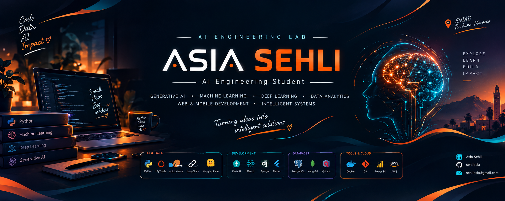

  

<!-- ===================== HEADER ===================== -->

<h1 align="center">Hi, I'm Asia Sehli 👋</h1>

<h3 align="center">
  AI Engineering Student | Generative AI & Machine Learning
</h3>

  
  
  

  

---

## 👩‍💻 About Me

I'm **Asia Sehli**, a third-year Artificial Intelligence Engineering student at **ENIAD, Berkane, Morocco**.

I am passionate about building intelligent applications that combine Artificial Intelligence, software engineering and data.

My interests and experience include:

- 🤖 Generative AI, LLMs and RAG systems
- 🧠 Machine Learning and Deep Learning
- 🔍 Intelligent systems and AI Agents
- 📊 Data Analytics and Business Intelligence
- 💻 Web and mobile application development

During my AI internship at **Sanad Global Solutions**, I contributed to the development of **Mo3allimAI**, an EdTech solution based on Generative AI, using RAG, hybrid search and vector databases.

I enjoy exploring real-world challenges and transforming ideas into practical technical solutions.

🎯 **Currently seeking a Final-Year Project (PFE) internship in Artificial Intelligence, Data or Software Development.**

---

## 🧠 AI & Technical Interests

  
  
  
  

| Domain | Focus |
|---|---|
| Generative AI | LLMs, RAG, Prompt Engineering |
| AI Agents | LangChain, LangGraph, Multi-Agent Systems |
| Machine Learning | Classification, Prediction, Scikit-learn |
| Deep Learning | CNN, MLP |
| NLP | Language processing and document-based AI |
| Data | ETL, Business Intelligence, Power BI |
| Software Engineering | APIs, Backend, Web & Mobile Development |

---

## 🛠️ Tech Stack

### 🐍 Programming Languages

  

### 🤖 Artificial Intelligence & Data

  
  
  
  
  

### ⚙️ Backend & Development

  

### 🗄️ Databases

  
  
  

### 🚀 DevOps, MLOps & Tools

  
  
  
  

---

## 🚀 Featured Projects

### 🤖 Mo3allimAI — Generative AI EdTech Solution

> An AI-powered educational solution designed to support Arabic language teaching for Moroccans living abroad.

**Key contributions:**
- Generative AI integration for educational assistance.
- RAG architecture combining hybrid search and vector databases.
- Backend and AI integration using FastAPI.

**Tech Stack:**

`Python` `FastAPI` `React` `PostgreSQL` `Qdrant` `LLMs` `RAG`

---

### 🎓 NourIA — Local & Offline AI Tutor

> An intelligent tutoring system designed to support Moroccan students through document-based assistance and educational interactions.

**Features & Focus:**
- Document-based question answering using RAG.
- Intelligent tutoring and AI Agents.
- Exploration of local and offline LLM execution.

**Tech Stack:**

`Python` `LangChain` `LangGraph` `llama.cpp` `FastAPI` `ChromaDB` `Electron.js`

---

### 📊 E-commerce Performance Analysis

> A Business Intelligence project for transforming commercial data into meaningful insights.

**Key features:**
- ETL pipeline for data preparation.
- Data analysis and business performance tracking.
- Interactive KPI dashboards.

**Tech Stack:**

`Talend` `Power BI` `ETL` `OLAP`

---

### 🎯 Academic Success Prediction

> A Machine Learning project focused on predicting students' academic success or dropout risk.

**Key focus:**
- Academic data analysis.
- Predictive Machine Learning.
- Model development using Scikit-learn.

**Tech Stack:**

`Python` `Pandas` `Scikit-learn`

---

### 🧾 ExpensePro — Mobile Expense Management

> A mobile application for managing employee expense reports.

**Features:**
- Expense management.
- Receipt information extraction using OCR.
- Local data storage.

**Tech Stack:**

`Flutter` `SQLite` `OCR`

---

### 🦷 Dental Clinic Management System

> A web application for managing dental clinic activities.

**Features:**
- Patient management.
- Appointment management.
- Medical record management.

**Tech Stack:**

`Django` `SQLite` `HTML` `CSS` `JavaScript`

---

## 📈 GitHub Activity

  

  

  

---

## 🌱 Currently Exploring

- 🔬 Machine Learning and Deep Learning experimentation.
- 🤖 LLMs, RAG architectures and AI Agents.
- ⚙️ AI application integration with FastAPI.
- 🐳 Docker and MLOps practices.
- 📊 Data Analytics and Business Intelligence.
- 💡 Innovative AI solutions for real-world problems.

---

## 🎯 Career Goals

I'm looking for opportunities to:

- Contribute to innovative Artificial Intelligence projects.
- Strengthen my Machine Learning and Deep Learning expertise.
- Develop and integrate AI models into practical applications.
- Collaborate with engineering and research teams.
- Learn from real-world AI challenges.

**Open to PFE internship opportunities in AI, Data Science and Software Development.**

---

## 🌍 Languages

- 🇲🇦 Arabic
- 🇫🇷 French
- 🇬🇧 English

---

## 📫 Let's Connect

  
  
  

  <i>"Building intelligent solutions, one project at a time."</i> 🚀

